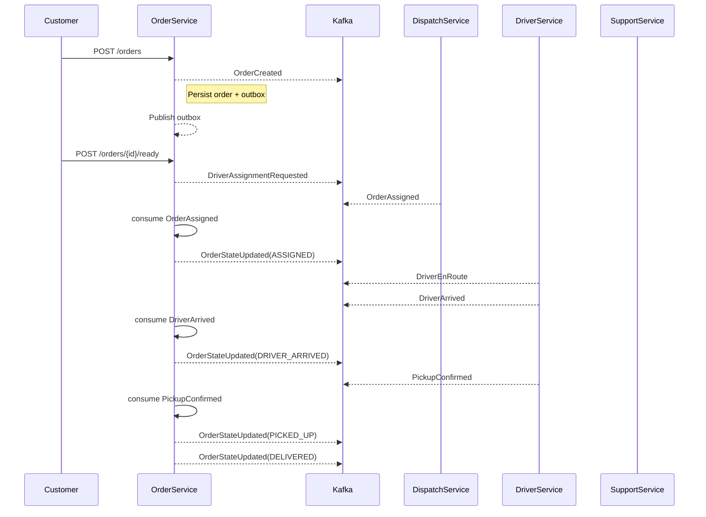
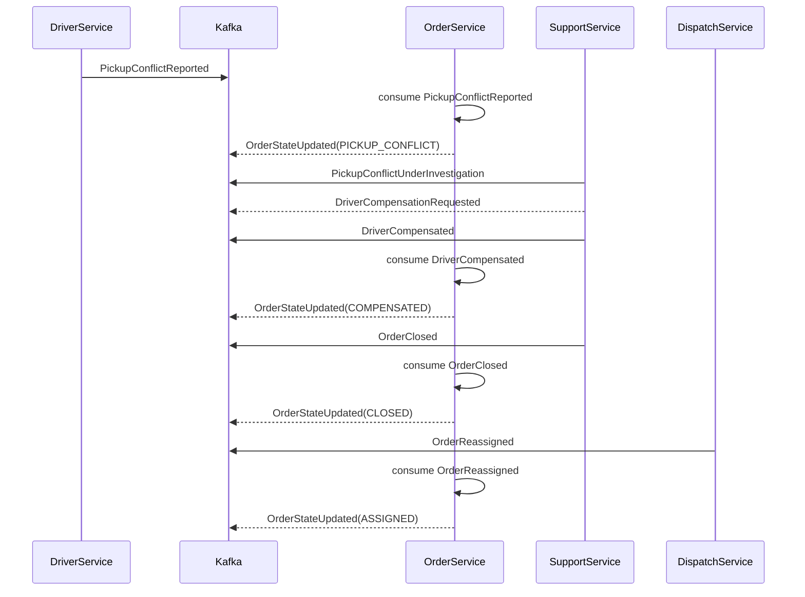

# delivery-platform-distributed-system Architecture

## 1. Vision and Scope

This project is an educational distributed systems demo built around a food delivery domain. It is intentionally not a commercial clone. The flagship business problem is **Pickup Conflict Resolution**: a driver arrives for a pickup, finds the order handed to a different driver, and the platform must execute a distributed compensation workflow while preserving a consistent final order state.

The architecture demonstrates:
- Java 21
- Spring Boot
- Apache Kafka
- PostgreSQL
- Redis
- Docker
- Kubernetes
- OpenTelemetry
- Testcontainers

Distributed systems patterns showcased:
- Event-driven architecture
- Saga pattern
- Transactional outbox pattern
- Idempotency
- Optimistic locking
- Eventual consistency
- Distributed transactions
- Retry policies
- Dead letter queues
- Message ordering
- Duplicate event handling
- Race condition handling
- Distributed tracing
- Fault tolerance

## 2. Microservices and Bounded Contexts

The system starts with **four services only**:

1. **Order Service**
   - Owns the order state machine and order lifecycle.
   - Responsible for order creation, restaurant acceptance, preparation, readiness, assignment lifecycle, and conflict state transitions.
   - Owns the source of truth for final order status.

2. **Dispatch Service**
   - Owns driver assignment and reassignment.
   - Handles assignment requests, resolves duplicate assignments, and publishes assignment events.

3. **Driver Service**
   - Owns driver status, arrival, pickup confirmations, and conflict reporting.
   - Simulates driver-side workflow and reports anomalies.

4. **Support Service**
   - Owns incident investigations, compensation decisions, and closure.
   - Orchestrates the conflict compensation saga after a pickup conflict is reported.

### Why these bounded contexts?

- **Order Service** is the aggregate owner of the order lifecycle and final state.
- **Dispatch Service** abstracts driver-assigning business rules from order state changes.
- **Driver Service** isolates the mobile-driver perspective and event reporting.
- **Support Service** encapsulates human investigation and compensation workflows.

This keeps the first phase manageable while still enabling realistic distributed patterns.

## 3. Service Responsibilities

### Order Service

- Accepts commands to create orders and change restaurant-facing state.
- Publishes order domain events via Kafka.
- Consumes assignment, driver, and support events to advance the state machine.
- Implements the order state machine and guards invalid transitions.
- Uses Optimistic Locking and the Transactional Outbox Pattern.

### Dispatch Service

- Receives assignment requests from Order Service.
- Picks the best driver or retries if a driver becomes unavailable.
- Publishes `OrderAssigned` and `OrderReassigned` events.
- Tracks duplicate assignment attempts and emits idempotent events.

### Driver Service

- Receives assignment events and tracks driver task progress.
- Publishes `DriverEnRoute`, `DriverArrived`, `PickupConfirmed`, and `PickupConflictReported`.
- Handles driver offline and stale status conditions.

### Support Service

- Receives conflict reports.
- Opens investigations and issues compensation workflows.
- Publishes `PickupConflictUnderInvestigation`, `DriverCompensationRequested`, `DriverCompensated`, and `OrderClosed`.
- Contains the long-running saga for conflict resolution.

## 4. Kafka Topics and Routing

Each service publishes to a dedicated topic namespace. Events are partitioned by `orderId` or `incidentId` to preserve ordering for a single aggregate.

### Topics

- `order.events`
- `dispatch.events`
- `driver.events`
- `support.events`
- `platform.dlq` (dead-letter queue for poison messages and unrecoverable events)

### Routing and partitioning

- Key by the aggregate ID: `orderId` for order-related events, `incidentId` for support incidents.
- Consume only relevant events across services.
- Use topic-level retention and compaction for debugging and replay.

### Why this topic design?

- Service-owned topics keep each service responsible for its event schema.
- Keying by aggregate ID preserves ordering within the critical path.
- A shared DLQ captures poison or invalid messages across the platform.

## 5. Domain Events

The platform uses rich domain events with standard metadata.

### Event envelope

Each event includes:
- `eventId`: globally unique UUID
- `eventType`
- `aggregateId`
- `aggregateType`
- `timestamp`
- `correlationId`
- `causationId`
- `payload`
- `version`

### Core event types

#### Order Service events
- `OrderCreated`
- `OrderAccepted`
- `OrderPreparing`
- `OrderReady`
- `DriverAssignmentRequested`
- `OrderAssignmentFailed`
- `OrderAssigned`
- `OrderStateUpdated`
- `OrderCancelled`
- `OrderClosed`

#### Dispatch Service events
- `DriverAssignmentRequested` (consumed)
- `OrderAssigned`
- `OrderReassigned`
- `AssignmentFailed`
- `DuplicateAssignmentDetected`

#### Driver Service events
- `DriverEnRoute`
- `DriverArrived`
- `PickupConfirmed`
- `PickupConflictReported`
- `DriverOffline`
- `StaleDriverUpdateIgnored`

#### Support Service events
- `PickupConflictUnderInvestigation`
- `DriverCompensationRequested`
- `DriverCompensated`
- `CompensationAlreadyProcessed`
- `OrderClosed`

### Idempotency and duplicate handling

- Each consumer persists `eventId` in a local `processed_events` table.
- A unique constraint on `(eventId)` prevents duplicate processing.
- Event handlers are designed to be idempotent and to ignore repeated messages.

## 6. Database Design

Each service owns its own PostgreSQL schema and a local outbox table. The outbox table is the bridge between the service database and Kafka.

### Order Service database

#### `orders`
- `order_id` UUID PK
- `customer_id` UUID
- `restaurant_id` UUID
- `status` VARCHAR
- `assigned_driver_id` UUID NULL
- `current_version` BIGINT
- `total_amount_cents` BIGINT
- `payment_status` VARCHAR
- `created_at` TIMESTAMP
- `updated_at` TIMESTAMP
- `last_event_id` UUID NULL

Indexes:
- PK on `order_id`
- unique on `order_id`
- index on `status`

#### `order_state_history`
- `history_id` UUID PK
- `order_id` UUID FK
- `previous_status` VARCHAR
- `next_status` VARCHAR
- `changed_by` VARCHAR
- `change_reason` TEXT
- `created_at` TIMESTAMP

#### `outbox_messages`
- `id` UUID PK
- `aggregate_type` VARCHAR
- `aggregate_id` UUID
- `event_type` VARCHAR
- `payload` JSONB
- `status` VARCHAR (`PENDING`, `SENT`, `FAILED`)
- `created_at` TIMESTAMP
- `sent_at` TIMESTAMP NULL
- `attempts` INT
- `last_error` TEXT NULL

### Shared service database pattern

All services follow the same pattern:
- Core domain table(s)
- Event store or history table for audit
- `outbox_messages`
- `processed_events` for idempotency
- Optimistic locking on aggregate version fields

### Optimistic locking

- `current_version` increments on each state transition.
- Updates require `WHERE version = :expectedVersion`.
- Stale update errors are surfaced as `409 CONFLICT` or retried with the latest state.

## 7. Order State Machine

### Allowed states

- `CREATED`
- `ACCEPTED`
- `PREPARING`
- `READY`
- `ASSIGNED`
- `DRIVER_EN_ROUTE`
- `DRIVER_ARRIVED`
- `PICKED_UP`
- `DELIVERED`

### Conflict path

- `DRIVER_ARRIVED`
- `PICKUP_CONFLICT`
- `UNDER_INVESTIGATION`
- `COMPENSATED`
- `CLOSED`

### Transition rules

- `CREATED -> ACCEPTED`
- `ACCEPTED -> PREPARING`
- `PREPARING -> READY`
- `READY -> ASSIGNED`
- `ASSIGNED -> DRIVER_EN_ROUTE`
- `DRIVER_EN_ROUTE -> DRIVER_ARRIVED`
- `DRIVER_ARRIVED -> PICKED_UP`
- `PICKED_UP -> DELIVERED`

Conflict transitions:
- `DRIVER_ARRIVED -> PICKUP_CONFLICT`
- `PICKUP_CONFLICT -> UNDER_INVESTIGATION`
- `UNDER_INVESTIGATION -> COMPENSATED`
- `COMPENSATED -> CLOSED`

### Invalid transition protection

- The Order Service rejects transitions not permitted by the state machine.
- `PICKUP_CONFLICT` is accepted only from `DRIVER_ARRIVED`.
- `PICKED_UP` or `DELIVERED` after cancellation or conflict is rejected.

## 8. REST API Design

The APIs are command-driven and align to domain operations.

### Order Service APIs

#### Create order
- `POST /api/v1/orders`
- Body: `{ "customerId": "...", "restaurantId": "...", "items": [...], "totalAmountCents": 1234 }`
- Publishes `OrderCreated`

#### Query order
- `GET /api/v1/orders/{orderId}`
- Returns current order state and assignment.

#### Accept order
- `POST /api/v1/orders/{orderId}/accept`
- Moves order to `ACCEPTED`

#### Mark preparing
- `POST /api/v1/orders/{orderId}/prepare`
- Moves order to `PREPARING`

#### Mark ready
- `POST /api/v1/orders/{orderId}/ready`
- Moves order to `READY`
- Publishes `DriverAssignmentRequested`

#### Report assignment result
- `POST /api/v1/orders/{orderId}/assignment`
- Body: `{ "driverId": "...", "assignmentId": "..." }`
- Used by Dispatch Service during early integration, but in production this is event-driven.

#### Report driver arrival
- `POST /api/v1/orders/{orderId}/driver-arrived`
- Moves order to `DRIVER_ARRIVED`

#### Report pickup conflict
- `POST /api/v1/orders/{orderId}/pickup-conflict`
- Moves order to `PICKUP_CONFLICT`
- Publishes `PickupConflictReported`

#### Get history
- `GET /api/v1/orders/{orderId}/history`
- Returns the order state history.

### Dispatch Service APIs

- `POST /api/v1/assignments`
- `GET /api/v1/assignments/{assignmentId}`
- `POST /api/v1/assignments/{assignmentId}/reassign`

### Driver Service APIs

- `GET /api/v1/drivers/{driverId}`
- `POST /api/v1/drivers/{driverId}/status`
- `POST /api/v1/drivers/{driverId}/arrived`
- `POST /api/v1/drivers/{driverId}/confirm-pickup`
- `POST /api/v1/drivers/{driverId}/report-conflict`

### Support Service APIs

- `GET /api/v1/incidents/{incidentId}`
- `POST /api/v1/incidents/{incidentId}/investigate`
- `POST /api/v1/incidents/{incidentId}/compensate`
- `POST /api/v1/incidents/{incidentId}/close`

## 9. Sequence Diagrams

### 9.1 Normal order dispatch flow

### 9.2 Pickup conflict resolution flow

## 10. Failure and Fault Tolerance

### Duplicate driver assignment
- Events may arrive more than once.
- Dispatch Service uses idempotent assignment processing and produces duplicate-safe `OrderAssigned` events.
- Order Service rejects repeated assignments for the same order if the state is already `ASSIGNED` or later.

### Duplicate pickup confirmation
- Driver events include `eventId` and are deduplicated by consumer.
- The Order Service ignores repeated `PickupConfirmed` messages once `PICKED_UP` is recorded.

### Pickup after cancellation
- State guards in Order Service prevent `PICKED_UP` or `DRIVER_ARRIVED` after `CANCELLED`.
- The consumer returns a rejected transition and may publish a compensation or cancellation audit event.

### Driver offline
- Driver Service publishes `DriverOffline` before `OrderAssigned` can complete.
- Dispatch Service can retry assignment or escalate.

### Restaurant closes unexpectedly
- A restaurant status event can trigger `OrderCancelled`.
- The Order Service transitions to a terminal state and publishes compensation workflow events.

### Duplicate compensation requests
- Support Service enforces unique compensation identifiers.
- Events like `DriverCompensationRequested` are idempotent; repeated requests are ignored once compensation is completed.

### Out-of-order Kafka events
- Ordering is preserved by topic key, but cross-topic ordering is eventually consistent.
- Consumers validate event causality using `version`, `aggregateId`, and current state.
- Illegal or stale events are moved to `platform.dlq` after retry exhaustion.

### Retry storms and dead-letter queues
- Kafka consumer groups use exponential backoff for transient failures.
- After repeated failures, events are published to `platform.dlq` with context.
- The outbox publisher uses retries and records failures in the outbox row.

### Stale updates and optimistic locking
- Every aggregate update checks the current `version`.
- Conflicts return `409 CONFLICT` and the client/service can refresh state before retrying.

## 11. Data Flow and Saga Orchestration

### Compensation saga

The pickup conflict saga is a distributed workflow across services:

1. `PickupConflictReported` triggers the saga.
2. Support Service opens an investigation and publishes `PickupConflictUnderInvestigation`.
3. Support Service issues `DriverCompensationRequested`.
4. Billing path internal to Support Service issues `DriverCompensated`.
5. Order Service consumes compensation completion and transitions to `COMPENSATED`.
6. Support Service publishes `OrderClosed` and Order Service transitions to `CLOSED`.

This is a **choreography-based saga** with clearly defined event handoffs and compensating state updates.

## 12. Production-quality practices

- **Clean architecture**: controllers/adapters, application services, domain, and persistence are separated.
- **DDD**: aggregates (`Order`, `Assignment`, `DriverTask`, `Incident`) own invariants.
- **Transactional Outbox**: state change and event enqueue happen in the same DB transaction.
- **Eventual consistency**: service boundaries are crossed through Kafka, not direct DB calls.
- **Distributed tracing**: each event carries `correlationId` and `causationId` to link spans.
- **Testcontainers**: integration tests run against PostgreSQL and Kafka locally.
- **Kubernetes**: each service is containerized and deployable with a service per pod plus shared Kafka/Redis.

## 13. Next step

If this design is approved, Phase 2 will implement the **Order Service** only, including:
- Spring Boot application with clean architecture
- PostgreSQL schema and Flyway migrations
- Spring Data JPA with optimistic locking
- Transactional outbox table and publish flow
- REST APIs for order state transitions
- Integration tests with Testcontainers
- Domain event payloads and Kafka producer wiring

